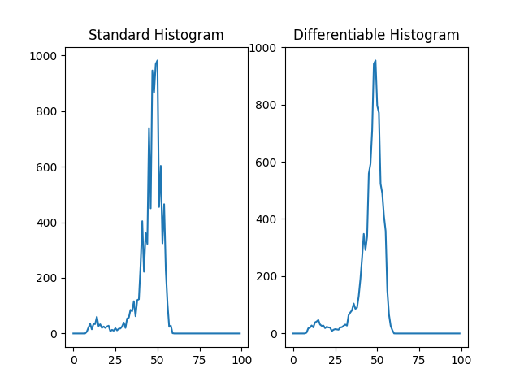

# pytorch-differentiable-histogram

## Usage
```
>> python differentiable_histogram.py
```



## Reference

[1] [valerystrizh/pytorch-histogram-loss](https://github.com/valerystrizh/pytorch-histogram-loss)

[2] ["Learning Deep Embeddings with Histogram Loss", NeurIPS 2016](https://arxiv.org/pdf/1611.00822.pdf)
